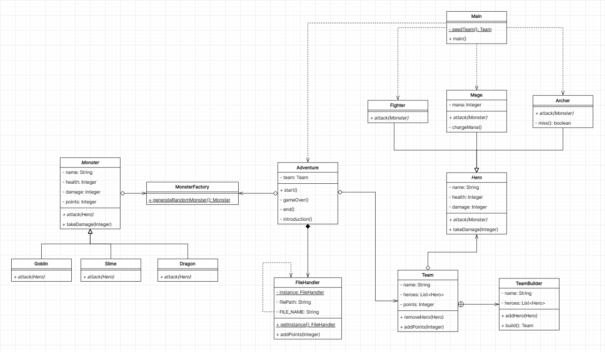

## Class Diagram

### Singleton

Class: [`FileHandler`](./src/util/FileHandler.java)

FileHandler kita bikin singleton karena:

- Kita pengen cuman ada 1 handler ke file, kalo dua bisa ada masalah sama open and closing file (bisa jadi saat kita mau
  write, ada class lain yang masih open file nya)

### Factory

Class: [`MonsterFactory`](./src/model/factory/MonsterFactory.java)

MonsterFactory dibikin factory dikarenakan:

- Kita mau generate random monster, kita (sebagai pengguna class) gamau tau hasil nya Dragon, Goblin atau yang lain,
  tapi yang jelas kita mau sebuah instance daripada class Monster (kita perlu method - methodnya aja)

### Builder

Class: [`TeamBuilder`](./src/model/Team.java)

TeamBuilder class berguna untuk build team nya, alasan:

- Kita mau pembuatan dari object Team itu dibalut oleh TeamBuilder agar bisa lebih readable code nya.
- Kita juga mau agar Team yang dibuat adalah sebuah class dengan final field (field yang gabisa diubah lagi) karena kalo
  udah dibikin kita gabisa set field lagi

### Facade

Class: [`Adventure`](./src/main/Adventure.java)

Adventure kita jadiin sebuah facade class untuk memulai adventure nya, alasan:

- Kita mau ngeenkapsulasi semua logic daripada game nya didalam class Adventure, sehingga yang keliatan dari luar cuman
  method start
- Berguna agar class lain gaperlu tau seberapa kompleks methodnya.